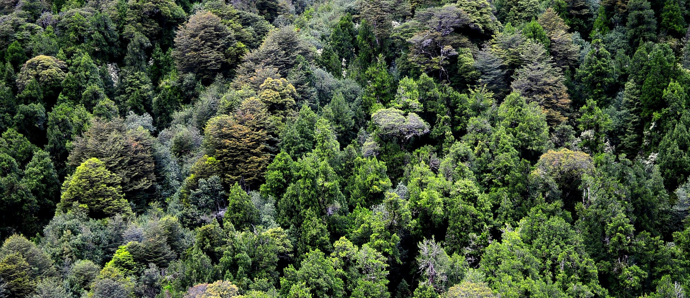

  

# Luis Camilo González Rodríguez 
### Ingeniero en Conservación de Recursos Naturales

**análisis geoespacial aplicado al territorio**, principalmente en temas forestales y de recursos naturales. Uso Python, R y Google Earth Engine para procesar información satelital y construir herramientas que apoyen la toma de decisiones territoriales.

---

- Procesamiento y análisis de imágenes satelitales (Landsat, Sentinel, MODIS) para monitoreo territorial.
- Desarrollo de scripts y herramientas geoespaciales en Python y R (automatización de flujos de trabajo, análisis espacial, generación de cartografía).
- Modelos y análisis en Google Earth Engine orientados a recursos forestales y cambios de cobertura.
- Consultoría técnica independiente en el área de conservación y geomática.

---

### Herramientas

---

### Proyectos

| Repositorio | Descripción |
|---|---|
| **[R](https://github.com/Luiscamilo99/R)** | Curso de introducción a la programación geoespacial en R. |
| **[CONAF](https://github.com/Luiscamilo99/CONAF)** | Herramientas en Python para análisis de datos forestales. |

---

Imágenes: Wikimedia Commons (CC BY-SA) y NASA (dominio público).

